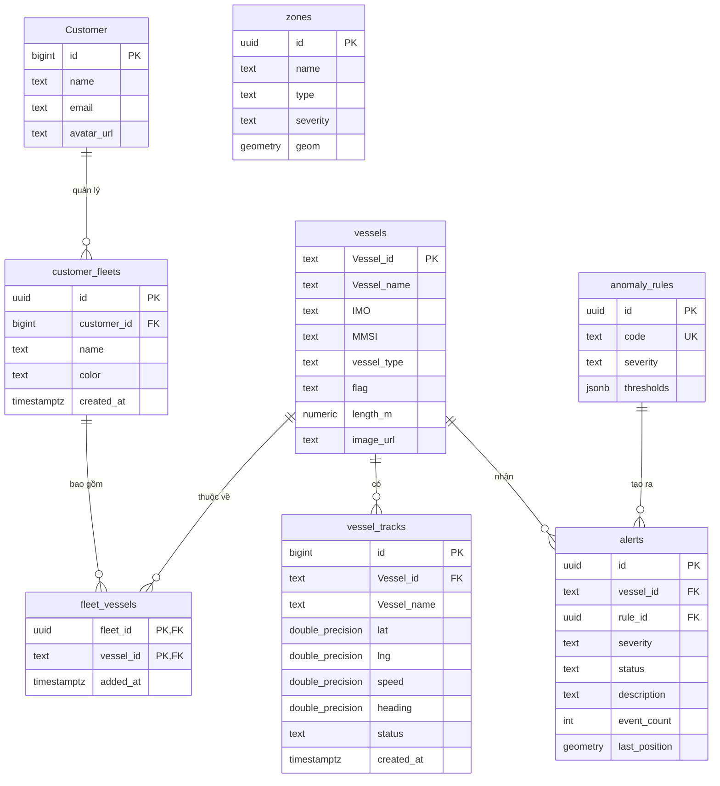

# TÀI LIỆU THIẾT KẾ CƠ SỞ DỮ LIỆU CHI TIẾT
## Hệ thống Giám sát Tàu biển (VMS Marine)
**Phiên bản:** 2.3 | **Cập nhật:** 2026-05-11 | **Nền tảng:** Supabase (PostgreSQL 15 + PostGIS)

> **Changelog:**
> - **v2.3** (2026-05-11) — Tích hợp Module Trí tuệ Hàng hải AI: schema `maritime_intelligence_schema.sql` (bảng `ais_messages`, `port_zones`, `voyages`, `port_kpis`, `ai_forecasts`, `anomalies`).
> - **v2.2** (2026-05-08) — Bổ sung schema Collision Warning System (CWS): cột `alert_type`, `vessel_id_b`, `cpa_nm`, `tcpa_min`, `event_count` vào bảng `alerts`; FK `alerts_vessel_id_b_fkey`; index `idx_alerts_collision`; migration file `collision_warning_setup.sql`
> - **v2.1** (2026-05-07) — Thêm bảng `alerts`, Geofencing triggers, PostGIS spatial index
> - **v2.0** (2026-05-01) — Schema ban đầu: `vessels`, `vessel_tracks`, `zones`, `customers`

---

## 1. Tổng quan kiến trúc dữ liệu

Cơ sở dữ liệu VMS Marine được triển khai trên **Supabase** (PostgreSQL) với các đặc điểm:

- **Extension**: `PostGIS` – xử lý dữ liệu không gian địa lý (geometry, spatial index).
- **Realtime**: Bật Supabase Realtime Pub/Sub cho `vessel_tracks`, `alerts`.
- **Storage**: Supabase Storage Buckets cho ảnh tàu.
- **RLS**: Row Level Security được bật để phân quyền truy cập.
- **Trigger Engine**: Tự động phát hiện vi phạm vùng thông qua PostGIS và PL/pgSQL.

---

## 2. Sơ đồ thực thể quan hệ (ERD)

---

## 3. Mô tả chi tiết từng bảng

### 3.1 Nhóm Quản lý Đội tàu (Fleet Grouping)

**Bảng `Customer`**: Thông tin người dùng.
- `id` (BIGINT): Định danh người dùng.
- `name`, `email`: Thông tin cá nhân.

**Bảng `customer_fleets`**: Nhóm tàu do người dùng tạo.
- `id` (UUID): Khóa chính.
- `customer_id` (BIGINT): Liên kết đến người dùng sở hữu.
- `name` (TEXT): Tên đội tàu.
- `color` (TEXT): Màu sắc đại diện (vd: `#38bdf8`).

**Bảng `fleet_vessels`**: Bảng trung gian n-n.
- `fleet_id` (UUID), `vessel_id` (TEXT): Khóa chính kép.

### 3.2 Nhóm Thông tin Tàu & Hành trình

**Bảng `vessels`**: Thông tin tĩnh của tàu.
- `Vessel_id` (TEXT): Mã định danh (PK).
- `Vessel_name` (TEXT), `IMO`, `vessel_type`, `flag`: Các thông tin đặc tả.

**Bảng `vessel_tracks`**: Lịch sử hành trình (Append-only).
- `id` (BIGINT): Khóa chính.
- `Vessel_id` (TEXT): FK đến `vessels`.
- `lat`, `lng`, `speed`, `heading`: Dữ liệu động học.
- `status` (TEXT): `normal`, `warning`, `danger` (Được cập nhật tự động bởi trigger khi có vi phạm).

### 3.3 Nhóm Không gian & Cảnh báo (Geofencing)

**Bảng `zones`**: Vùng địa lý.
- `id` (UUID), `name`, `type`, `severity`.
- `geom` (GEOMETRY(Polygon, 4326)): Hình học vùng, lưu tọa độ không gian thật. Có index GIST.

**Bảng `anomaly_rules`**: Định nghĩa luật.
- `code` (TEXT): VD: `ZONE_VIOLATION`, `SPEED_LIMIT`.

**Bảng `alerts`**: Các cảnh báo phát sinh.
- `id` (UUID), `vessel_id` (TEXT), `rule_id` (UUID), `severity`, `status`.
- `last_position` (GEOMETRY(Point, 4326)): Điểm vi phạm cuối.
- `event_count` (INT): Số lần vi phạm.

### 3.4 Module Trí tuệ Hàng hải AI (Maritime Intelligence)
Lưu trữ dữ liệu phục vụ riêng cho cụm tính toán AI cảng biển.
- **`ais_messages`**: Lưu trữ tín hiệu AIS gốc (chưa qua xử lý tracking), dùng để phân tích mật độ (Heatmap).
- **`port_zones`**: Định nghĩa tọa độ các vùng neo, vùng bến, điểm đón trả hoa tiêu.
- **`voyages`**: Quản lý lịch trình, thời gian chờ (waiting time), thời gian bến (turnaround time), ước tính lượng hàng hóa dựa trên tải trọng.
- **`vessel_events`**: Ghi nhận các mốc sự kiện neo/cập bến.
- **`port_kpis`**: Bảng dữ liệu đã tổng hợp theo ngày (aggregate KPIs) phục vụ thuật toán AI dự báo.
- **`ai_forecasts`**: Lưu trữ kết quả dự báo sản lượng và chỉ số tắc nghẽn của mô hình AI (horizon 7/30 ngày).
- **`anomalies`**: Cảnh báo bất thường chuyên sâu (vd: tắc nghẽn vùng neo, ETA lệch) cho người quản lý cảng.

---

## 4. Trigger và Logic Backend (Geofencing Engine)

- **`check_zone_violation(lat, lng)`**: Hàm sử dụng PostGIS `ST_Contains` để kiểm tra tọa độ có nằm trong zone nào không.
- **`process_vessel_track_alerts(...)`**: Hàm chính được gọi qua trigger `on_vessel_track_insert` mỗi khi có track mới.
  - Kiểm tra vi phạm thông qua `check_zone_violation`.
  - Sinh hoặc cập nhật bản ghi `alerts` (`ZONE_VIOLATION`).
  - Tự động thay đổi cột `status` trong `vessel_tracks` tương ứng mức độ cảnh báo (warning, danger).

*(Lưu ý: Hệ thống UI cũng có cơ chế Fallback sử dụng Ray-casting để tính toán Point-in-Polygon khi realtime PostGIS bị trễ).*

---

## 5. Security (RLS)

- Bật Row Level Security cho toàn bộ các bảng.
- Hiện tại policy đang mở (vd: `FOR ALL USING (true)`) để hỗ trợ phát triển, nhưng kiến trúc đã sẵn sàng để chuyển đổi sang bảo vệ mức tenant (`auth.uid()`).
- Bảng `customer_fleets` và `fleet_vessels` đã được cấu hình RLS đầy đủ.
