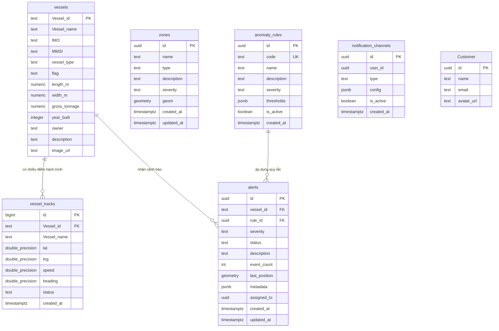
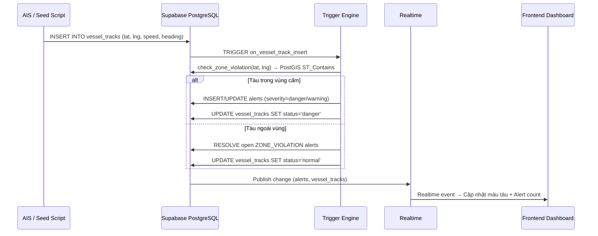

# TÀI LIỆU THIẾT KẾ CƠ SỞ DỮ LIỆU CHI TIẾT
## Hệ thống Giám sát Tàu biển (VMS Marine)
**Phiên bản:** 2.0 | **Cập nhật:** 2026-05-05 | **Nền tảng:** Supabase (PostgreSQL 15 + PostGIS)

---

## 1. Tổng quan kiến trúc dữ liệu

Cơ sở dữ liệu VMS Marine được triển khai trên **Supabase** (PostgreSQL) với các đặc điểm:

- **Extension**: `PostGIS` – xử lý dữ liệu không gian địa lý (geometry, spatial index)
- **Realtime**: Bật Supabase Realtime Pub/Sub cho `vessel_tracks` và `alerts`
- **Storage**: Supabase Storage Buckets cho ảnh tàu và avatar người dùng
- **RLS**: Row Level Security được bật trên toàn bộ bảng
- **Trigger Engine**: PostgreSQL Trigger + PL/pgSQL tự động phát hiện bất thường

---

## 2. Sơ đồ thực thể quan hệ (ERD)



---

## 3. Mô tả chi tiết từng bảng

### 3.1 Bảng `vessels` – Thông tin tĩnh tàu

Lưu trữ thông tin định danh và thông số kỹ thuật cố định của tàu.

| Cột | Kiểu dữ liệu | Ràng buộc | Mô tả |
|-----|-------------|-----------|-------|
| `Vessel_id` | `TEXT` | PK | Mã định danh duy nhất. Format: `{FLAG}-{NUMBER}` (VD: `VNM-088`) |
| `Vessel_name` | `TEXT` | NOT NULL | Tên tàu |
| `IMO` | `TEXT` | — | Mã số IMO quốc tế (7 chữ số, do IMO cấp) |
| `MMSI` | `TEXT` | — | Maritime Mobile Service Identity (9 chữ số, dùng trong AIS) |
| `vessel_type` | `TEXT` | — | Loại tàu: `Container`, `Oil Tanker`, `LNG Tanker`, `Bulk Carrier`, `Passenger`, `Fishing`, `Chemical Tanker`, `Heavy Lift` |
| `flag` | `TEXT` | — | Quốc tịch tàu (Quốc gia treo cờ). VD: `Việt Nam`, `Panama` |
| `length_m` | `NUMERIC` | — | Chiều dài tổng thể (mét) |
| `width_m` | `NUMERIC` | — | Chiều rộng (mét) |
| `gross_tonnage` | `NUMERIC` | — | Tổng dung tích (GT) |
| `year_built` | `INTEGER` | — | Năm đóng tàu |
| `owner` | `TEXT` | — | Chủ sở hữu / Công ty quản lý |
| `description` | `TEXT` | — | Mô tả thêm |
| `image_url` | `TEXT` | — | URL ảnh tàu (lưu trên Supabase Storage bucket `vessel-images`) |

**Ghi chú thiết kế:**
- `Vessel_id` được thiết kế dạng `TEXT` thay vì `UUID` để dễ đọc và đồng bộ với dữ liệu AIS thực tế.
- Các thông tin động như vị trí, tốc độ **không** lưu ở bảng này — chúng thuộc về `vessel_tracks`.

---

### 3.2 Bảng `vessel_tracks` – Lịch sử hành trình

Bảng append-only, ghi nhận mỗi bản tin vị trí từ AIS hoặc hệ thống giả lập.

| Cột | Kiểu dữ liệu | Ràng buộc | Mô tả |
|-----|-------------|-----------|-------|
| `id` | `BIGINT` | PK, auto-increment | Định danh bản ghi, dùng trong trigger |
| `Vessel_id` | `TEXT` | FK → `vessels(Vessel_id)`, ON UPDATE CASCADE, ON DELETE RESTRICT | Tàu sở hữu bản ghi này |
| `Vessel_name` | `TEXT` | — | Tên tàu (redundant, phục vụ truy vấn nhanh) |
| `lat` | `DOUBLE PRECISION` | — | Vĩ độ (độ thập phân, WGS-84) |
| `lng` | `DOUBLE PRECISION` | — | Kinh độ (độ thập phân, WGS-84) |
| `speed` | `DOUBLE PRECISION` | — | Tốc độ qua nước (knots) |
| `heading` | `DOUBLE PRECISION` | — | Hướng mũi tàu (0–360°, Bắc = 0°) |
| `status` | `TEXT` | DEFAULT `'normal'` | Trạng thái được engine phát hiện: `normal` / `warning` / `danger` |
| `created_at` | `TIMESTAMPTZ` | DEFAULT `now()` | Thời điểm ghi nhận |

**Chỉ mục:**
- Index trên `(Vessel_id, created_at DESC)` – tối ưu cho truy vấn "lịch sử gần nhất của tàu X"

**Ghi chú thiết kế:**
- Đây là bảng **append-only** — không cập nhật, chỉ thêm mới.
- Ngoại lệ: cột `status` được cập nhật **ngay sau khi INSERT** bởi Trigger `on_vessel_track_insert`.
- Realtime được bật: Frontend subscribe để nhận cập nhật vị trí tức thì.

---

### 3.3 Bảng `zones` – Vùng địa lý

Định nghĩa các vùng biển đặc biệt (khu vực cấm, cảnh báo, hải cảng, luồng hàng hải).

| Cột | Kiểu dữ liệu | Ràng buộc | Mô tả |
|-----|-------------|-----------|-------|
| `id` | `UUID` | PK, DEFAULT `gen_random_uuid()` | Định danh duy nhất |
| `name` | `TEXT` | NOT NULL | Tên vùng. VD: "Khu vực Hoàng Sa" |
| `type` | `TEXT` | NOT NULL | Phân loại: `restricted`, `warning`, `port`, `shipping_lane` |
| `description` | `TEXT` | — | Mô tả chi tiết |
| `severity` | `TEXT` | DEFAULT `'warning'` | Mức độ: `warning` hoặc `danger` |
| `geom` | `GEOMETRY(Polygon, 4326)` | — | Hình học vùng (Đa giác, hệ tọa độ WGS-84 SRID 4326) |
| `created_at` | `TIMESTAMPTZ` | DEFAULT `now()` | Ngày tạo |
| `updated_at` | `TIMESTAMPTZ` | DEFAULT `now()` | Ngày cập nhật (tự động qua trigger) |

**Chỉ mục không gian:**
```sql
CREATE INDEX zones_geom_idx ON zones USING GIST (geom);
```
> GiST index giúp hàm `ST_Contains()` kiểm tra điểm-trong-vùng cực nhanh, cần thiết khi trigger gọi mỗi khi có track mới.

**Dữ liệu mẫu (seed):**

| Tên vùng | Type | Severity | Phạm vi (Lon/Lat) |
|----------|------|----------|-------------------|
| Khu vực Hoàng Sa | restricted | danger | 111.0–113.5°E, 15.5–17.5°N |
| Khu vực Trường Sa | restricted | danger | 111.5–117.0°E, 7.5–12.0°N |
| Vùng bảo trì cáp quang Vũng Tàu | warning | warning | 107.0–107.5°E, 10.0–10.5°N |

---

### 3.4 Bảng `anomaly_rules` – Quy tắc phát hiện bất thường

Cấu hình các quy tắc nghiệp vụ cho engine phát hiện tự động.

| Cột | Kiểu dữ liệu | Ràng buộc | Mô tả |
|-----|-------------|-----------|-------|
| `id` | `UUID` | PK | Định danh |
| `code` | `TEXT` | UNIQUE, NOT NULL | Mã quy tắc. VD: `ZONE_VIOLATION` |
| `name` | `TEXT` | NOT NULL | Tên quy tắc hiển thị |
| `description` | `TEXT` | — | Mô tả chi tiết |
| `severity` | `TEXT` | DEFAULT `'warning'` | Mức độ mặc định: `warning` / `danger` |
| `thresholds` | `JSONB` | DEFAULT `'{}'` | Ngưỡng cấu hình linh hoạt |
| `is_active` | `BOOLEAN` | DEFAULT `true` | Bật/tắt quy tắc |
| `created_at` | `TIMESTAMPTZ` | DEFAULT `now()` | — |

**Các quy tắc mặc định:**

| Code | Tên | Severity | Thresholds |
|------|-----|----------|------------|
| `ZONE_VIOLATION` | Vi phạm vùng cấm | danger | `{"buffer_nm": 1.0}` |
| `SPEED_LIMIT` | Quá tốc độ quy định | warning | `{"max_speed": 25}` |
| `DARK_VESSEL` | Mất tín hiệu AIS | warning | `{"timeout_mins": 30}` |
| `PROXIMITY_RISK` | Nguy cơ va chạm | danger | `{"min_dist_nm": 0.5}` |

---

### 3.5 Bảng `alerts` – Cảnh báo

Ghi nhận các sự kiện bất thường được phát hiện tự động hoặc thủ công.

| Cột | Kiểu dữ liệu | Ràng buộc | Mô tả |
|-----|-------------|-----------|-------|
| `id` | `UUID` | PK | Định danh cảnh báo |
| `vessel_id` | `TEXT` | FK → `vessels(Vessel_id)` ON DELETE CASCADE | Tàu liên quan |
| `rule_id` | `UUID` | FK → `anomaly_rules(id)` ON DELETE SET NULL | Quy tắc kích hoạt |
| `severity` | `TEXT` | NOT NULL | `info` / `warning` / `danger` |
| `status` | `TEXT` | DEFAULT `'open'` | Trạng thái xử lý: `open` / `acknowledged` / `resolved` / `dismissed` |
| `description` | `TEXT` | — | Mô tả sự kiện. VD: "Tàu xâm nhập vùng Hoàng Sa" |
| `event_count` | `INT` | DEFAULT `1` | Số lần tàu tiếp tục vi phạm (tăng mỗi track mới) |
| `last_position` | `GEOMETRY(Point, 4326)` | — | Vị trí cuối cùng ghi nhận vi phạm |
| `metadata` | `JSONB` | DEFAULT `'{}'` | Chi tiết bổ sung: `{"zone_id": "...", "zone_name": "..."}` |
| `assigned_to` | `UUID` | — | Operator được phân công xử lý |
| `created_at` | `TIMESTAMPTZ` | DEFAULT `now()` | Thời điểm phát sinh |
| `updated_at` | `TIMESTAMPTZ` | DEFAULT `now()` | Cập nhật lần cuối (tự động qua trigger) |

**Chỉ mục:**
```sql
CREATE INDEX alerts_vessel_id_idx ON alerts(vessel_id);
CREATE INDEX alerts_status_idx    ON alerts(status);
```

**Vòng đời trạng thái:**
```
open → acknowledged → resolved
 └──────────────────→ dismissed
```

**Ghi chú thiết kế:**
- Alert được **gộp** (merge): mỗi cặp `(vessel_id, rule_id, zone_id)` chỉ có một alert `open` tại một thời điểm.
- Khi tàu rời khỏi vùng, alert `ZONE_VIOLATION` tự động chuyển sang `resolved`.
- `event_count` tăng dần theo số track vi phạm → đo mức độ nghiêm trọng.
- Realtime được bật: Dashboard cập nhật màu trạng thái tàu ngay khi có alert mới.

---

### 3.6 Bảng `notification_channels` – Kênh thông báo

Cấu hình các kênh nhận thông báo cảnh báo.

| Cột | Kiểu dữ liệu | Ràng buộc | Mô tả |
|-----|-------------|-----------|-------|
| `id` | `UUID` | PK | Định danh |
| `user_id` | `UUID` | — | Liên kết người dùng (Supabase Auth) |
| `type` | `TEXT` | NOT NULL | `email` / `telegram` / `web_push` |
| `config` | `JSONB` | NOT NULL | Cấu hình kênh. VD: `{"chat_id": "123456"}` |
| `is_active` | `BOOLEAN` | DEFAULT `true` | Bật/tắt kênh |
| `created_at` | `TIMESTAMPTZ` | DEFAULT `now()` | — |

---

### 3.7 Bảng `Customer` – Người dùng hệ thống

| Cột | Kiểu dữ liệu | Ràng buộc | Mô tả |
|-----|-------------|-----------|-------|
| `id` | `UUID` | PK | Định danh (liên kết Supabase Auth) |
| `name` | `TEXT` | — | Họ tên |
| `email` | `TEXT` | — | Email đăng nhập |
| `avatar_url` | `TEXT` | — | URL ảnh đại diện (Supabase Storage bucket `avatars`) |

---

## 4. View tổng hợp

### 4.1 View `vessel_current_positions`

Kết hợp thông tin tĩnh của tàu với vị trí mới nhất từ `vessel_tracks`.

```sql
CREATE OR REPLACE VIEW vessel_current_positions AS
SELECT
  v.*,
  t.lat,
  t.lng,
  t.speed,
  t.heading,
  t.status,
  t.created_at AS last_seen
FROM vessels v
LEFT JOIN LATERAL (
  SELECT lat, lng, speed, heading, status, created_at
  FROM vessel_tracks vt
  WHERE vt."Vessel_id" = v."Vessel_id"
  ORDER BY vt.created_at DESC
  LIMIT 1
) t ON true;
```

**Mục đích:** API `/vessels` dùng view này để trả về danh sách tàu kèm vị trí hiện tại trong một query duy nhất.

---

## 5. Trigger và Stored Functions

### 5.1 Trigger `on_vessel_track_insert`

Được kích hoạt **sau mỗi INSERT** vào `vessel_tracks`.

```
INSERT vessel_tracks
    → TRIGGER on_vessel_track_insert (AFTER INSERT, FOR EACH ROW)
        → FUNCTION trg_process_vessel_track()
            → FUNCTION process_vessel_track_alerts(vessel_id, lat, lng, speed, track_id)
```

### 5.2 Function `check_zone_violation(v_lat, v_lng)`

Kiểm tra xem điểm tọa độ có nằm trong vùng nào không.

- **Input**: `v_lat DOUBLE PRECISION`, `v_lng DOUBLE PRECISION`
- **Output**: Bảng `(zone_id UUID, zone_name TEXT, zone_type TEXT, zone_severity TEXT)`
- **Cơ chế**: `ST_Contains(geom, ST_SetSRID(ST_Point(v_lng, v_lat), 4326))` – dùng GiST index

### 5.3 Function `process_vessel_track_alerts(...)` – Engine phát hiện chính

**Tham số:**

| Tham số | Kiểu | Mô tả |
|---------|------|-------|
| `p_vessel_id` | `TEXT` | Mã tàu |
| `p_lat` | `DOUBLE PRECISION` | Vĩ độ |
| `p_lng` | `DOUBLE PRECISION` | Kinh độ |
| `p_speed` | `DOUBLE PRECISION` | Tốc độ (knots) |
| `p_track_id` | `BIGINT` | ID bản ghi vessel_tracks vừa insert |

**Luồng xử lý:**

```
[A] Kiểm tra vi phạm vùng cấm
    ├─ Gọi check_zone_violation(lat, lng)
    ├─ Với mỗi zone vi phạm:
    │   ├─ Nâng track_status lên warning/danger
    │   ├─ Tìm alert OPEN có cùng (vessel, rule, zone)
    │   │   ├─ Nếu chưa có → INSERT alert mới
    │   │   └─ Nếu đã có   → UPDATE event_count + 1
    └─ Nếu không vi phạm zone nào → RESOLVE tất cả ZONE_VIOLATION open

[B] Kiểm tra quá tốc độ (speed > 25 knots)
    ├─ Nâng track_status lên warning
    ├─ Tìm alert SPEED_LIMIT OPEN
    │   ├─ Nếu chưa có → INSERT alert mới
    │   └─ Nếu đã có   → UPDATE event_count + 1

[C] Cập nhật status vào vessel_tracks
    └─ UPDATE vessel_tracks SET status = v_track_status WHERE id = p_track_id
```

### 5.4 Function `update_updated_at_column()`

Trigger function chung để tự động cập nhật cột `updated_at`:
- Áp dụng cho bảng `zones` và `alerts`

---

## 6. Storage Buckets

| Bucket ID | Tên | Public | Mục đích |
|-----------|-----|--------|----------|
| `vessel-images` | vessel-images | ✅ | Ảnh đại diện tàu |
| `avatars` | avatars | ✅ | Ảnh đại diện người dùng |

**Chính sách (Policy):** Toàn bộ cho phép SELECT (public read), INSERT, UPDATE, DELETE.

---

## 7. Chính sách bảo mật (Row Level Security)

| Bảng | RLS | Chính sách |
|------|-----|-----------|
| `vessels` | ✅ Bật | `vessels_all`: Cho phép ALL (đơn giản hóa cho dev) |
| `vessel_tracks` | ✅ Bật | `vessel_tracks_all`: Cho phép ALL |
| `zones` | ✅ Bật | `zones_public_read`: SELECT cho tất cả; `zones_admin_all`: ALL |
| `anomaly_rules` | ✅ Bật | `rules_public_read`: SELECT cho tất cả |
| `alerts` | ✅ Bật | `alerts_public_all`: Cho phép ALL |
| `Customer` | ✅ Bật | `customer_all`: Cho phép ALL |

> **Lưu ý bảo mật:** Các policy hiện tại đang ở chế độ "mở" phục vụ phát triển. Trong môi trường production cần giới hạn quyền ghi theo `auth.uid()`.

---

## 8. Luồng dữ liệu hệ thống



---

## 9. Dữ liệu tàu mẫu (Seed)

| Vessel_id | Tên tàu | Loại | Quốc tịch | Trọng tải (GT) |
|-----------|---------|------|-----------|----------------|
| PAN-992 | Ever Glory | Container | Panama | 219,000 |
| LIB-451 | MSC Oscar | Container | Liberia | 192,240 |
| SGP-202 | BW Pavilion | LNG Tanker | Singapore | 104,100 |
| MHL-888 | Front Altair | Oil Tanker | Marshall Islands | 62,450 |
| JPN-100 | Nippon Maru | Passenger | Japan | 22,470 |
| VNM-088 | Hải Âu 8 | Fishing | Việt Nam | 200 |
| CHN-999 | Zhen Hua 30 | Heavy Lift | China | 82,000 |
| KOR-774 | Hyundai Pride | Container | South Korea | 142,400 |
| MYS-331 | Bunga Jasmine | Chemical Tanker | Malaysia | 24,500 |
| GRC-005 | Olympic Sea | Bulk Carrier | Greece | 40,100 |

---

## 10. Hướng dẫn thiết lập môi trường

### Thứ tự chạy SQL scripts

```
1. alert_system_setup.sql      → Tạo extension PostGIS, bảng zones, anomaly_rules, alerts, notification_channels
2. supabase_setup.sql          → Cấu hình lại bảng vessels (thêm cột tĩnh), vessel_tracks (thêm status), FK, View, RLS, Storage
3. vms_detection_logic.sql     → Tạo hàm check_zone_violation() và process_vessel_track_alerts()
4. fix_alert_engine_types.sql  → Fix kiểu dữ liệu (uuid→bigint), cập nhật lại function signature
5. diagnose_and_fix_zones.sql  → Tái tạo hoàn chỉnh toàn bộ engine + trigger (phiên bản cuối)
6. vms_trigger_setup.sql       → Tạo trigger on_vessel_track_insert
```

### Seed dữ liệu

```bash
# 1. Thêm tàu và track ban đầu
node seed.mjs

# 2. Thêm vùng địa lý (zones)
node seed_zones.mjs

# 3. Thêm lịch sử hành trình chi tiết
node seed_tracks.mjs
```

---

## 11. Phụ lục: Tóm tắt kỹ thuật

| Hạng mục | Chi tiết |
|----------|---------|
| Nền tảng DB | Supabase (PostgreSQL 15) |
| Extension | PostGIS (geometry, spatial index GiST) |
| Hệ tọa độ | WGS-84, SRID 4326 |
| Kiểu geometry | `GEOMETRY(Polygon, 4326)` cho zones, `GEOMETRY(Point, 4326)` cho alerts |
| Realtime | `supabase_realtime` publication: `vessel_tracks`, `alerts` |
| Auth | Supabase Auth (UUID user_id) |
| Storage | Supabase Storage: `vessel-images`, `avatars` |
| RLS | Bật toàn bộ, policy mở cho dev |
| Trigger | `AFTER INSERT ON vessel_tracks FOR EACH ROW` |
| Ngôn ngữ Function | `PL/pgSQL SECURITY DEFINER` |
