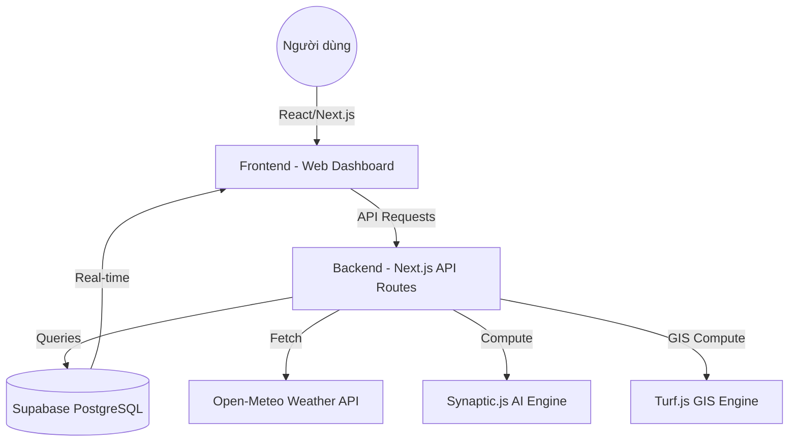

# TÀI LIỆU THIẾT KẾ TỔNG THỂ HỆ THỐNG - VESSEL MONITORING SYSTEM (VMS)

## 1. Tổng quan hệ thống
Hệ thống Giám sát Tàu thuyền (Vessel Monitoring System - VMS) là một ứng dụng Web thời gian thực được thiết kế để theo dõi vị trí, trạng thái và lịch sử hành trình của đội tàu. Hệ thống tích hợp Trí tuệ nhân tạo (AI) để dự báo quỹ đạo và các thuật toán hình học để tối ưu hóa hải trình dựa trên nhiều tiêu chí (ETA, Nhiên liệu, Thời tiết, Rủi ro).

### Các tính năng chính:
- **Theo dõi thời gian thực (Real-time Tracking)**: Hiển thị vị trí tàu tức thời trên bản đồ tương tác.
- **Phân tích lịch sử**: Truy xuất và hiển thị quỹ đạo di chuyển của tàu trong quá khứ (1h, 12h, 24h...).
- **Quản lý Đội tàu (Fleet Grouping)**: Tạo và quản lý các nhóm tàu tùy chỉnh, bộ lọc động và gán màu sắc định danh trên bản đồ.
- **Vùng cảnh báo cá nhân (Custom Geofencing)**: Vẽ và quản lý đa giác khép kín để thiết lập cảnh báo vào/ra khu vực (cảng, vùng cấm).
- **Lớp phủ Thời tiết (Weather Overlays)**: Hiển thị lớp bản đồ hàng hải và khí tượng (OpenSeaMap) phục vụ điều hướng an toàn.
- **Dự báo quỹ đạo AI**: Sử dụng mạng thần kinh LSTM để dự đoán hướng đi của tàu trong tương lai (4h - 24h).
- **Tối ưu lộ trình (ETA Optimization)**: Tính toán đường đi ngắn nhất tránh vật cả đất liền và đề xuất lộ trình tối ưu dựa trên hàm chi phí linh hoạt.

---

## 2. Kiến trúc hệ thống
Hệ thống được xây dựng trên mô hình hiện đại dựa trên đám mây (Cloud-native).



### Các thành phần chính:
1. **Frontend**: Next.js, React, Leaflet (Quản lý bản đồ), CSS thuần (Styling).
2. **Backend**: Next.js API Routes (Serverless), xử lý logic nghiệp vụ và tính toán.
3. **Database**: Supabase cung cấp giải pháp lưu trữ dữ liệu và Real-time Subscriptions qua PostgreSQL.
4. **GIS & AI**:
   - `Turf.js`: Xử lý các phép toán hình học không gian (khoảng cách, cắt lớp đất liền, bẻ cong lộ trình).
   - `Synaptic.js`: Thư viện mạng thần kinh thuần JavaScript dùng cho mô hình LSTM dự báo quỹ đạo.

---

## 3. Thiết kế Cơ sở dữ liệu (Supabase)

### 3.1 Bảng `vessels` (Thông tin tĩnh)
Lưu trữ thông tin định danh và thông số kỹ thuật của tàu.
- `Vessel_id`: Mã định danh duy nhất (Primary Key).
- `Vessel_name`: Tên tàu.
- `IMO`, `MMSI`: Các mã định danh hàng hải quốc tế.
- `vessel_type`: Loại tàu (Container, Tanker, Fishing...).
- `flag`: Quốc tịch.
- `length_m`, `width_m`: Kích thước.
- `image_url`: Ảnh đại diện của tàu.

### 3.2 Bảng `vessel_tracks` (Dữ liệu hành trình)
Lưu trữ các điểm dữ liệu lịch sử và vị trí hiện tại.
- `id`: Định danh bản ghi.
- `Vessel_id`: Đối chiếu với bảng vessels.
- `lat`, `lng`: Tọa độ địa lý.
- `speed`: Vận tốc (Knots).
- `heading`: Hướng tàu (0-360 độ).
- `status`: Trạng thái (Normal, Warning, Danger).
- `created_at`: Thời điểm ghi nhận dữ liệu (Timestamp).

### 3.3 Bảng `zones` và Cảnh báo (Alerts)
- **zones**: Quản lý các vùng cảnh báo, vùng cấm, cảng biển. Tích hợp `PostGIS` với cột `geom` kiểu `geometry(Polygon, 4326)` để phân tích không gian. Dữ liệu được hỗ trợ hiển thị và vẽ tương tác ngay trên Frontend.
- **alerts**: Quản lý các cảnh báo được sinh ra (vi phạm tốc độ, đi vào vùng cấm) thông qua các trigger SQL tự động.

### 3.4 Quản lý Khách hàng và Đội tàu
- Các bảng mở rộng như `Customer`, `customer_fleets` và `fleet_vessels` (chứa quan hệ giữa khách hàng và tàu) cho phép thiết lập chế độ đa người dùng (Multi-tenant). Tuy nhiên, hiện tại Front-end cũng hỗ trợ lưu trữ trạng thái Fleet thông qua `LocalStorage` để linh hoạt thử nghiệm.

---

## 4. Thuật toán cốt lõi

### 4.1 Dự báo quỹ đạo AI (LSTM)
- **Mô hình**: Mạng Long Short-Term Memory (LSTM) được huấn luyện trực tiếp trên 50 điểm hành trình gần nhất của tàu.
- **Input**: Chuỗi Delta vận tốc và Delta hướng đi từ quá khứ.
- **Output**: Vị trí dự báo (Lat, Lng) cho từng giờ tiếp theo.
- **Cơ chế phòng vệ**: Tích hợp kiểm tra `turf.booleanPointInPolygon` để dừng dự báo nếu quỹ đạo AI dự đoán đâm vào đất liền.

### 4.2 Tối ưu hóa hải trình (ETA Optimization)
Sử dụng hàm chi phí đa mục tiêu để tìm ra phương án di chuyển tốt nhất:
$$Cost = a \cdot Time + b \cdot Fuel + c \cdot Risk + d \cdot Weather$$

*Xem chi tiết phân tích toán học và logic tại: [ETA_ALGORITHM_DEEP_DIVE.md](file:///c:/Users/Lenovo/Desktop/VMS/ETA_ALGORITHM_DEEP_DIVE.md)*

- **Time**: Ưu tiên tốc độ tối đa.
- **Fuel**: Ưu tiên tốc độ kinh tế (Economic Speed) để giảm tiêu hao nhiên liệu.
- **Risk & Weather**: Tự động lệch tâm lộ trình (Perturbation) để né tránh vùng bão hoặc vùng nguy hiểm dựa trên dữ liệu thời thực từ Open-Meteo.

---

## 5. Hướng dẫn cài đặt và Triển khai

### 5.1 Cài đặt môi trường phát triển (Local)
1. **Yêu cầu**: Node.js v18+.
2. **Cài đặt dependencies**:
   ```bash
   npm install
   ```
3. **Cấu hình biến môi trường**: Tạo tệp `.env.local` tại thư mục gốc:
   ```env
   NEXT_PUBLIC_SUPABASE_URL=your_supabase_url
   NEXT_PUBLIC_SUPABASE_ANON_KEY=your_supabase_anon_key
   ```
4. **Chạy ứng dụng**:
   ```bash
   npm run dev
   ```

### 5.2 Triển khai (Deployment)
1. **Source Control**: Đẩy mã nguồn lên một Repository GitHub.
2. **Hosting**: Kết nối Repo GitHub với **Vercel**.
3. **Lưu ý Vercel**:
   - Cấu hình Environment Variables tương tự như `.env.local`.
   - File bản đồ địa lý được đặt trong `lib/data/` để đảm bảo được đóng gói (bundle) cùng Serverless Functions.

---

## 6. Bảo mật và Hiệu năng
- **Bảo mật**: Sử dụng Supabase RLS (Row Level Security) để bảo vệ dữ liệu. Các API Keys nhạy cảm được ẩn trong biến môi trường phía Server.
- **Hiệu năng**: UI Render phía Client với `react-leaflet`. Các tính năng tính toán nặng (AI/ETA) được tách ra các API Route riêng biệt để không gây tắc nghẽn giao diện người dùng.
- **GIS Optimization**: Dữ liệu đường bờ biển được đơn giản hóa để giảm tải cho tính toán không gian.
