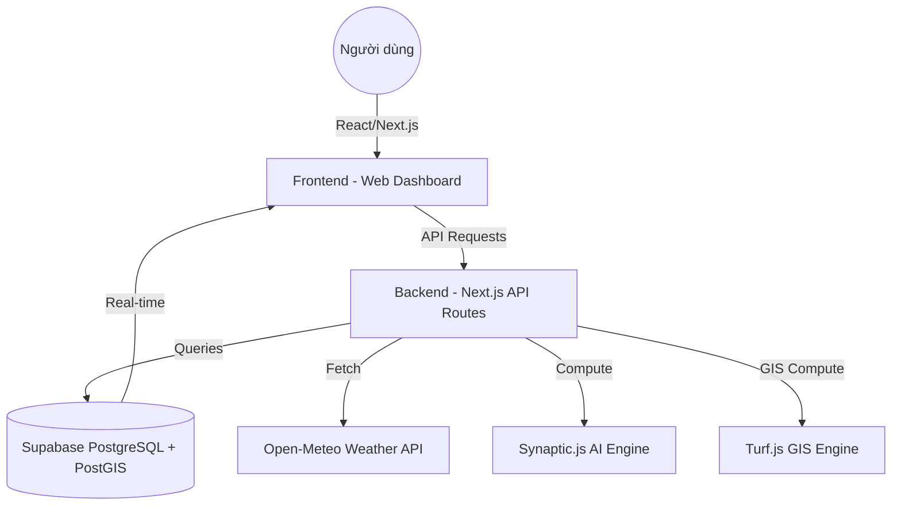

# TÀI LIỆU THIẾT KẾ TỔNG THỂ HỆ THỐNG - VESSEL MONITORING SYSTEM (VMS)

> **Phiên bản:** 2.2 | **Cập nhật:** 2026-05-11
>
> **Changelog:**
> - **v2.2** (2026-05-11) — Tích hợp Module Trí tuệ Hàng hải AI (Maritime Intelligence): Dự báo sản lượng (XGBoost/LSTM), Bản đồ mật độ (Heatmap), Phát hiện bất thường vùng neo đậu.
> - **v2.1** (2026-05-08) — Tích hợp Collision Warning System (CWS): CPA/TCPA engine, CollisionAlert UI, CollisionOverlay, CollisionHistoryPanel, DashboardMenu CPA layer control, layout phân vùng UI
> - **v2.0** (2026-05-07) — Track Replay, Fleet Grouping, Geofencing, Weather Layers, AlertDrawer
> - **v1.0** (2026-05-01) — Core: Real-time tracking, AI prediction, route optimization

## 1. Tổng quan hệ thống
Hệ thống Giám sát Tàu thuyền (Vessel Monitoring System - VMS) là một ứng dụng Web thời gian thực được thiết kế để theo dõi vị trí, trạng thái và lịch sử hành trình của đội tàu. Hệ thống tích hợp Trí tuệ nhân tạo (AI) để phân tích, dự báo quỹ đạo, tính toán mật độ hàng hải, và tối ưu hóa hải trình. Phiên bản mới nhất bổ sung **Module Trí tuệ Hàng hải AI (Maritime Intelligence)** phục vụ phân tích cụm cảng biển.

### Các tính năng chính:
- **Theo dõi thời gian thực (Real-time Tracking)**: Hiển thị vị trí tàu tức thời trên bản đồ tương tác với cập nhật dữ liệu liên tục qua WebSockets.
- **Phân tích và Mô phỏng Lịch sử (Track Replay)**: Truy xuất và hiển thị quỹ đạo di chuyển của tàu trong quá khứ thông qua `TrackReplayLayer`. Cho phép phát lại (Play/Pause), điều chỉnh tốc độ, tua (scrub) và tự động thay đổi khung hình (map bounds) tập trung vào quỹ đạo.
- **Quản lý Đội tàu (Fleet Grouping)**: Tạo và quản lý các nhóm tàu tùy chỉnh, bộ lọc động và gán màu sắc định danh trên bản đồ. Hỗ trợ đa người dùng (Multi-tenant).
- **Vùng cảnh báo cá nhân & Geofencing**: Vẽ và quản lý đa giác khép kín để thiết lập cảnh báo vào/ra khu vực (cảng, vùng cấm). Hỗ trợ cả Engine cơ sở dữ liệu (PostGIS) và Fallback cảnh báo trên Client (Point-in-Polygon Ray-casting).
- **Lớp phủ Khí tượng & Hải dương (Weather & Velocity Layers)**: Hiển thị lớp bản đồ hàng hải và khí tượng (dòng chảy, sức gió, v.v.) với thiết kế Glassmorphism trực quan, hỗ trợ điều hướng an toàn.
- **Dự báo quỹ đạo AI**: Sử dụng mạng thần kinh LSTM để dự đoán hướng đi của tàu trong tương lai (4h - 24h).
- **Tối ưu lộ trình (ETA Optimization)**: Tính toán đường đi ngắn nhất tránh đất liền và đề xuất lộ trình tối ưu dựa trên hàm chi phí linh hoạt.
- **Cảnh báo Va chạm (CWS)**: Tính toán CPA/TCPA theo thời gian thực cho tất cả cặp tàu, phân loại mức nguy hiểm, lưu trữ lịch sử và cảnh báo UI.
- **Trí tuệ Hàng hải AI (Maritime Intelligence — v2.2 mới)**: Cung cấp Dashboard toàn cảnh tình hình khu vực cảng. Phân tích lưu lượng hàng hóa, dự báo 7/30 ngày (sử dụng thuật toán Gradient Boosting/Trend Analysis), biểu đồ mật độ (Heatmap), và phát hiện bất thường tự động (chống tắc nghẽn, theo dõi khu neo đậu).


---

## 2. Kiến trúc hệ thống
Hệ thống được xây dựng trên mô hình hiện đại dựa trên đám mây (Cloud-native).



### Các thành phần chính:
1. **Frontend**: Next.js, React, Leaflet (Quản lý bản đồ), UI/UX với Glassmorphism, TailwindCSS / Vanilla CSS. Cung cấp các panel kiểm soát như `WeatherPanel`, `TrackReplayLayer`.
2. **Backend**: Next.js API Routes (Serverless), xử lý logic nghiệp vụ và tính toán đồng bộ.
3. **Database**: Supabase cung cấp giải pháp lưu trữ dữ liệu (PostgreSQL) và Real-time Subscriptions. Tích hợp PostGIS cho phân tích không gian.
4. **GIS & AI**:
   - `Turf.js` & `Client Ray-casting`: Xử lý các phép toán hình học không gian (khoảng cách, cắt lớp đất liền, kiểm tra Point-in-Polygon).
   - `Synaptic.js`: Thư viện mạng thần kinh thuần JavaScript dùng cho mô hình LSTM dự báo quỹ đạo.

---

## 3. Thiết kế Cơ sở dữ liệu (Supabase)
*Chi tiết bảng, ràng buộc và cấu trúc xem thêm tại `DATABASE_DESIGN.md`.*

### 3.1 Thực thể Chính (Core Entities)
- **vessels**: Thông tin định danh và thông số kỹ thuật của tàu.
- **vessel_tracks**: Các điểm dữ liệu lịch sử và vị trí hiện tại (append-only), lưu trữ `status` để phản ánh an toàn.

### 3.2 Hệ thống Cảnh báo Không gian (Spatial Alerts)
- **zones**: Quản lý các vùng cảnh báo, vùng cấm. Sử dụng `geometry(Polygon, 4326)` từ PostGIS.
- **anomaly_rules**: Các cấu hình vi phạm, ví dụ `ZONE_VIOLATION`, `SPEED_LIMIT`.
- **alerts**: Quản lý các cảnh báo được sinh ra thông qua triggers tự động khi có track mới.

### 3.3 Quản lý Khách hàng và Đội tàu (Fleets)
- **Customer**: Bảng người dùng hệ thống.
- **customer_fleets**: Nhóm tàu do khách hàng định nghĩa (ID, màu sắc, tên).
- **fleet_vessels**: Bảng trung gian liên kết giữa đội tàu và tàu, hỗ trợ n-n relationships.

---

## 4. Thuật toán và Logic Cốt lõi

### 4.1 Cơ chế Cảnh báo Vùng (Geofence Engine)
- **Backend (PostGIS)**: Sử dụng trigger `on_vessel_track_insert` để gọi function `process_vessel_track_alerts`. Kiểm tra `ST_Contains` giữa track mới và các zones. Tự động sinh `alerts` và cập nhật `status`.
- **Frontend Fallback**: Sử dụng thuật toán Point-in-Polygon (Ray-casting) để xác định tàu nằm trong hay ngoài vùng ngay trên trình duyệt, đảm bảo Dashboard hiển thị cảnh báo ngay cả khi backend bị chậm.

### 4.2 Dự báo quỹ đạo AI (LSTM)
- **Mô hình**: Mạng Long Short-Term Memory (LSTM) huấn luyện trực tiếp trên chuỗi điểm hành trình.
- **Cơ chế phòng vệ**: Tích hợp kiểm tra để dừng dự báo nếu quỹ đạo AI dự đoán đâm vào đất liền (`turf.booleanPointInPolygon`).

### 4.3 Tối ưu hóa hải trình (ETA Optimization)
Sử dụng hàm chi phí đa mục tiêu để tìm phương án di chuyển tốt nhất:
$$Cost = a \cdot Time + b \cdot Fuel + c \cdot Risk + d \cdot Weather$$
- **Risk & Weather**: Tự động lệch tâm lộ trình (Perturbation) để né tránh vùng bão dựa trên dữ liệu từ Open-Meteo và hệ thống hiển thị thời tiết (`VelocityLayer`).

---

## 5. Hướng dẫn Cài đặt và Triển khai

### 5.1 Cài đặt môi trường phát triển
1. **Yêu cầu**: Node.js v18+.
2. **Cài đặt dependencies**: `npm install`
3. **Cấu hình môi trường (`.env.local`)**:
   ```env
   NEXT_PUBLIC_SUPABASE_URL=your_supabase_url
   NEXT_PUBLIC_SUPABASE_ANON_KEY=your_supabase_anon_key
   ```
4. **Chạy ứng dụng**: `npm run dev`

### 5.2 Triển khai (Deployment)
1. **Hosting**: Khuyến nghị sử dụng **Vercel** do sự tương thích tốt với Next.js Serverless.
2. **Dữ liệu tĩnh**: Đảm bảo các file bản đồ/geojson đặt trong `public/` hoặc `lib/data/` để bundle chính xác.
3. **Supabase**: Cần chạy đầy đủ các script SQL trong repository (đặc biệt các script setup PostGIS và Triggers) trên môi trường Supabase Production.

---

## 6. Bảo mật và Hiệu năng
- **Bảo mật**: Sử dụng Row Level Security (RLS) của Supabase để cách ly dữ liệu giữa các Customer. Keys nhạy cảm được quản lý qua server.
- **Hiệu năng**: 
  - Tối ưu hóa hiển thị Bản đồ với `React-Leaflet`, tránh re-render bằng cách memoize các markers và layers.
  - Tách bạch logic tính toán nặng vào Web Workers hoặc Backend API.
  - Sử dụng GiST index trong PostGIS để tăng tốc độ truy vấn `ST_Contains`.
